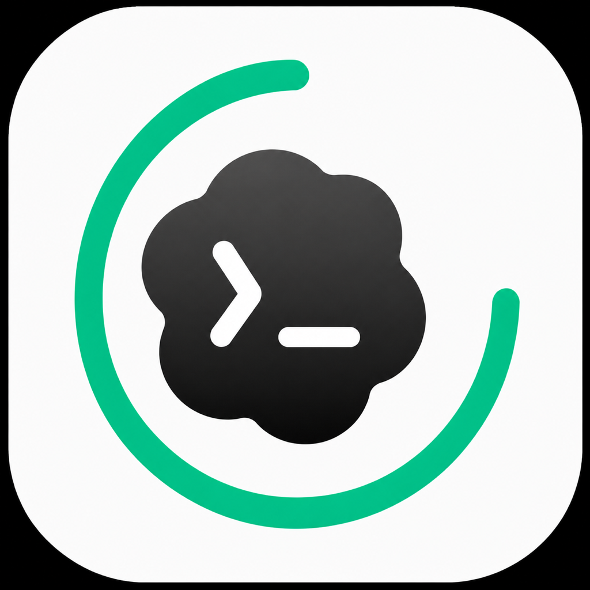

# CodeX Usage Bar

A fully open-source, local-only macOS menu-bar app that shows the latest Codex weekly quota remaining from local Codex session logs.

> **Private by design:** CodeX Usage Bar makes no network connections and uploads no data. It reads only the Codex session records already stored on your Mac and runs entirely on-device.



## Download and install

1. Download the latest macOS ZIP from [Releases](../../releases).
2. Unzip it and move **CodeX Usage Bar.app** to your Applications folder.
3. Launch it from Applications. Because the community build is ad-hoc signed and not Apple-notarized, macOS may require Control-clicking the app and choosing **Open** on first launch.

No Codex login, API key, browser access, or network connection is required. The app appears only in the menu bar and does not add a Dock icon.

## Features

- Shows weekly quota remaining directly in the macOS menu bar.
- Visualizes the weekly remainder as a ring that is consumed clockwise from the top.
- Refreshes from local Codex logs whenever the menu is opened.
- Displays a weekly remaining progress bar and reset time.
- Shows the top five local projects by token share over the last seven days.
- Uses no network requests, browser cookies, API keys, or model calls.
- Has no polling timer; project totals refresh at most once per hour when the menu is opened.

## Requirements

- macOS 13 or later
- Codex Desktop or Codex CLI with local session logs under `~/.codex`

## Build

```bash
zsh build.sh
open "build/CodeX Usage Bar.app"
```

The build script uses only Apple's command-line tools and creates an ad-hoc signed app. Public release builds are not Apple-notarized, so on first launch use Control-click → **Open** if Gatekeeper asks.

## Data and privacy

The app reads JSONL files from `~/.codex/sessions` and `~/.codex/archived_sessions`. It contains no networking code, never reads browser data, and never uploads analytics, usage records, credentials, or any other data. The displayed value is the latest quota snapshot written locally by Codex, so usage on another device may not appear until this Mac receives a new local quota record.

It does not modify or delete Codex session files. It stores only its menu-bar display preference in the standard local macOS preferences system.

## How refresh works

- Weekly quota is refreshed from the newest local Codex record whenever you open the menu.
- Project totals are calculated locally and refreshed at most once per hour when the menu is opened.
- There is no background polling timer, telemetry service, updater, or always-running network task.

## Current limitations

- The app can only show quota information present in this Mac's local Codex records.
- If your account usage changes on another device, the value may remain unchanged until Codex writes a newer record on this Mac.
- Current Codex records expose the weekly quota window; the app therefore does not show a five-hour quota window.
- Project usage is an on-device seven-day estimate derived from local session logs, not a server-side billing report.

## Uninstall

Choose **退出 App** from the menu, then move **CodeX Usage Bar.app** from Applications to the Trash. It installs no launch daemon, helper tool, kernel extension, updater, or browser extension.

## Open source and remixing

The complete source code is published in this repository under the MIT License. You are welcome to inspect it, fork it, adapt it, and build your own version. CodeX Usage Bar was created by Qingdian Dai with assistance from OpenAI Codex and is intended only for local, on-device use.

## Author

Qingdian Dai

## License

MIT
